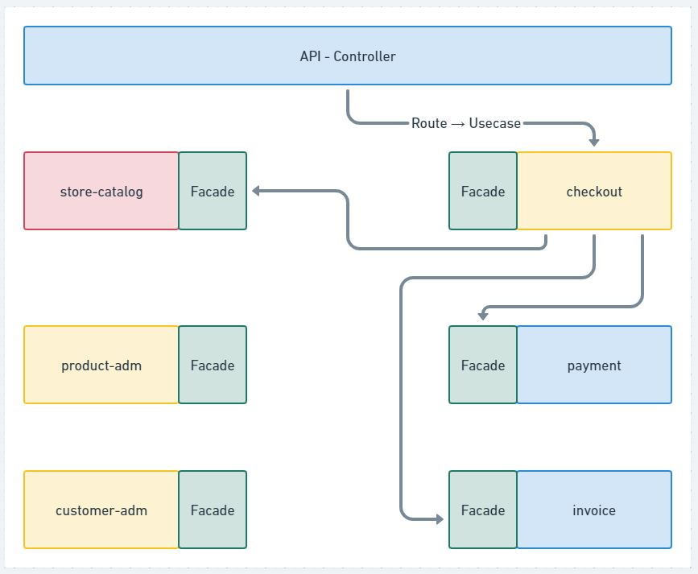

# Sistemas Monolíticos

### O que é uma aplicação monolítica
- Aplicações "tradicionais"
- Tudo em um
- **Única unidade de deployment**. Para o deploy do module de produtos o módulo de vendas também tem que ir junto.
  
#### Polêmica por trás das aplicações monolíticas
- Aplicações da década passada
- Ultrapassada
- Não escalam
- Impedem o crescimento do negócio
- Alto acoplamento

**Grande parte dos argumentos são: FALSOS**

#### Quando utilizar monolitos pode ser uma boa
- Novos projetos onde o modelo de negócio não está claro
- Instabilidade no core do negócio
- Evitar complexidade no processo de deploy
- Evitar complexidade na operação

**95% das vezes, utilizar sistemas monolíticos é a melhor opção**

#### Tipos de sistemas monolíticos
- Single process
- Monolitos distribuidos
- Black box

Newman, Sam. Monolith to Microservices (p. 21). O'Reilly Media.

**Single process**

- Alto acoplamento. (Dependencia forte entre classes/modulos)
- Modular
- Modular com bancos de dados segregados

**Vamos pensar em longo prazo com "User"**

De uma forma ou de outra tudo se relaciona com User

User| - 
---|---
Dados pessoais | Email mkt
Endereços| Campanhas
Cartões de crédito| Favoritos
Tickets de suporte| Lista de casamento
Compras| Historico de login
Carrinho abandonado| Lista de preferencias de emails
Devoluções| Avaliação de produtos
Financiamento| CRM
Indicações| Propostas
Reclamações| Lances / Leilão
Cartão de Pontos |

#### Principais problemas com essa abordagem

- Não existe contexto
- Entidades que se relacionam
- Não há divisão. Tudo faz parte de tudo. Tudo grudado em tudo
- Efeitos colateriais indesejados

**Precisamos evitar isso!**

#### DDD é um ponto de partida

Contextos
- Catálogo [user]
- Carrinho [user]
- Checkout [user]
- Pagamentos [cliente]
- Suporte ao Cliente [cliente]
- Marketing [lead]
- Programa de pontos [beneficiario]
- Lista de casamento [convidado]

#### Sistemas monolíticos modulares
- Módulos quebrados em "bounded contexts"
- Conversam através de contratos e façades
- Entidades podem ser "duplicadas" tendo apenas os atributos necessários
- Equipes especializadas por módulos
- Alta coesão: O que muda junto, permanece junto.

#### Sistemas monolíticos modulares com bancos segregados

  

**Se é para segregar tanto, não é melhor já trabalhar com microsserviços?**

#### Sistemas monolíticos modulares

- Um único deploy
- Única operação
- Observabilidade simplificada
- Sistemas se comunicando internamente
- Única linguagem. Menos governança
- ...

### Shared Kernel

- Núcleo compartilhado entre módules que faz parte do projeto.
- Politicas claras de atualizações

### Relembrando DDD

- Linguagem Universal
- Dominio
- Dominio quebrado em subdominios. Dominio principal e subdominios auxiliares/genericos
- Shared Kernel, Camadas anticorrupção.
- Cada contexto possui seu universo e que pode conversar com outros contextos.

### CodeStore - Context Map

- store-catalog - (Dominio Principal)
- product-adm - (Dominio Auxiliar)
- customer-adm - (Dominio Auxiliar)
- checkout - (Dominio Auxiliar)
- payment - (Pode ser Dominio Generico ou Auxiliar dependendo da criticidade/estrategia)
- invoice - (Pode ser Dominio Generico ou Auxiliar dependendo da criticidade/estrategia)

### Comunicação entre módulos

Uma forma de fazer com que esses Modulos se comuniquem em uma aplicação monolitica, sem gerar acoplamento, é através de **Facade / Fachada**

### Comunicação interna vs externa

Camada de infraestrutura chamada de API - Controllers (cross customs)
Caso de Uso não pode chamar Caso de Uso e sim por meio de uma Fachada
Um módullo é cliente de outro módulo por meio das Fachadas (Facades)

